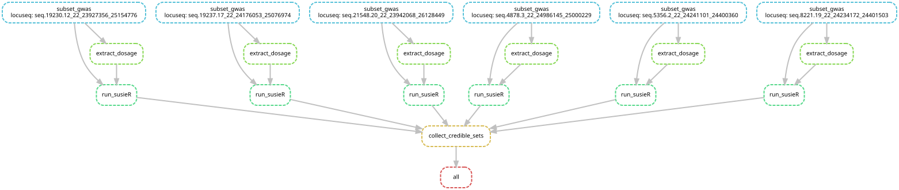

# pqtl_susie
A snakemake pipeline for fine-mapping protein QTLs using SuSiE
Here we run SuSiE using on the meta-analysis GWAS results via in-sample LD.

## Outputs

### 1. Characteristics of the genomic regions

Table: `combined_reports.tsv`
|seqid        |locus                    |nsample_pgen |nvar_pgen | nvar_gwas| nvar_shared| nsnps_shared| nindels_shared| nbi_allelic| nmulti_allelic| run_time_min|ld_from_X | ld_size_mg| ld_ev_min| ld_ev_negative|ld_ev_condition      |    lambda|lambda_warning |
|:------------|:------------------------|:------------|:---------|---------:|-----------:|------------:|--------------:|-----------:|--------------:|------------:|:---------|----------:|---------:|--------------:|:--------------------|---------:|:--------------|
|seq.10000.28 |chr17_28071104_28415105  |NA |NA | 1905| 1905| 1773| 132| 1905| 0| 0.11|FALSE | 37.04| -6.8e-06|  55|1008693 | 0.0141|NA  |
|seq.10001.7  |chr17_28265920_28413121  |NA |NA | 1348| 1348| 1262|  86| 1348| 0| 0.10|FALSE | 18.42| -6.7e-06|  45|6763316 | 0.0028|NA  |
|seq.10003.15 |chr19_44883210_44926451  |NA |NA | 1644| 1644| 1540| 104| 1644| 0| 0.10|FALSE | 27.45| -4.6e-06|  45|1107961 | 0.0020|NA             |
|seq.10006.25 |chr9_114069727_114069727 |NA |NA | 1222| 1222| 1161|  61| 1222| 0| 0.11|FALSE | 15.05| -1.3e-06|  21|3412773 | 0.0022|NA  |
|seq.10008.43 |chr1_169330603_169552615 |NA |NA | 2231| 2231| 2062| 169| 2231| 0| 0.24|FALSE | 49.36| -1.1e-05| 224|4287335 | 0.0001|NA  |

Description of the reported features:
|Column          | Description                             |
|:---------------|:----------------------------------------|
|seqid           |                                         |
|locus           |                                         |
|nsample_pgen    |                                         |
|nvar_pgen       |                                         |
|nvar_gwas       |                                         |
|nvar_shared     |                                         |
|nsnps_shared    |                                         |
|nindels_shared  |                                         |
|nbi_allelic     |                                         |
|nmulti_allelic  |                                         |
|run_time_min    |                                         |
|ld_from_X       |                                         |
|ld_size_mg      |                                         |
|ld_ev_min       |                                         |
|ld_ev_negative  |                                         |
|ld_ev_condition |                                         |
|lambda          | Index value for LD-GWAS mismatch, [0,1) |
|lambda_warning  |                                         |

### 2. The 99% credible sets for each fine-mapped genomic region

|seqid        |locus                    | cs_id| cs_log10bf| cs_avg_r2| cs_min_r2| ncs|cs_snps  |
|:------------|:------------------------|---:|--------:|----:|----:|---:|:---------------|
|seq.10460.1  |chr1_200795068_203437639 |   3| 1.15e+01| 1.00| 1.00|   1|1:203211000:C:T |
|seq.10460.1  |chr1_200795068_203437639 |   1| 3.27e+02| 1.00| 1.00|   1|1:203214000:A:C |
|seq.10460.1  |chr1_200795068_203437639 |   2| 1.65e+02| 1.00| 1.00|   1|1:203225000:C:T |
|seq.10460.1  |chr1_200795068_203437639 |   6| 1.01e+01| 0.99| 0.99|   3|1:203229000:GA:G,1:203229000:G:T,1:203230000:C:T |
|seq.10460.1  |chr1_200795068_203437639 |   4| 1.08e+01| 0.95| 0.88|  11|1:203229000:A:G,1:203239000:A:C |
|seq.10512.13 |chr22_36851809_37058505  |   4| 2.93e+01| 0.95| 0.71|  45|22:36908000:A:G,22:36908000:A:T |
|seq.10512.13 |chr22_36851809_37058505  |   1| 6.54e+02| 1.00| 1.00|   1|22:36933000:A:G |
|seq.10512.13 |chr22_36851809_37058505  |   2| 6.42e+01| 1.00| 1.00|   1|22:36937000:G:T |
|seq.13268.45 |chr2_20935300_21238858   | no_credible| NA| NA|   NA|  NA|NA              |
|seq.10606.34 |chr2_89119570_96189561   |   4| 3.25e+04| 0.99| 0.99|   2|2:89125000:A:T,2:89126000:G:T |
|seq.10606.34 |chr2_89119570_96189561   |   2| 1.95e+04| 1.00| 1.00|   1|2:89869000:A:C  |

### 3. GWAS sumstats of the credible sets
Table: `combined_cssums.tsv`

<>

## Workflow example

